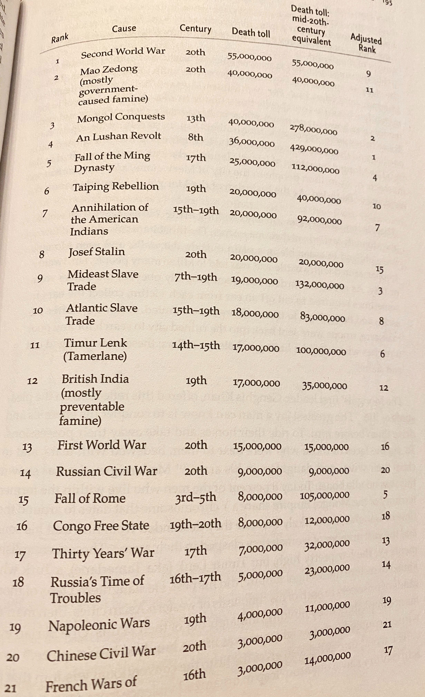
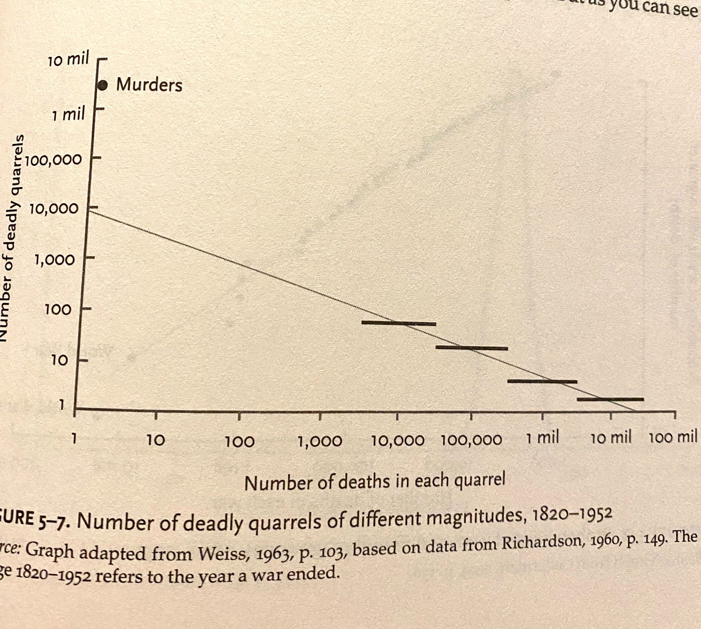

# The Better Angels of Our Nature: Why Violence Has Declined

(2011)

By Steven Pinker

## About the author

Steven Pinker is oe of America's leading public intellectuals.

From [Wikipedia](https://en.wikipedia.org/wiki/Steven_Pinker):

>  Pinker is a Canadian-American cognitive psychologist, linguist, and popular science author. He is an advocate of evolutionary psychology and the computational theory of mind.

> Pinker's academic specializations are visual cognition and psycholinguistics. His experimental subjects include mental imagery, shape recognition, visual attention, children's language development, regular and irregular phenomena in language, the neural bases of words and grammar, and the psychology of cooperation and communication, including euphemism, innuendo, emotional expression, and common knowledge. He has written two technical books that proposed a general theory of language acquisition and applied it to children's learning of verbs. In particular, his work with Alan Prince published in 1989 critiqued the connectionist model of how children acquire the past tense of English verbs, arguing instead that children use default rules such as adding "-ed" to make regular forms, sometimes in error, but are obliged to learn irregular forms one by one.

# Initial reaction

Clocking in at 696 pages, this information-dense, chart-heavy 2011 look at the decline of violence in human history is probably one of the most important works of nonfiction in the past 30 years. 

It's definitely not the first book to note the decline of violence but possibly the most comprehensive, surveying the work of dozens of academic fields, hundreds of scholarly books and articles all while writing in a vivid, conversational tone that never feels condescending or wonky.

# The numbers on the decline in violence

The title itself might come as a shock to most people -- considering world wars, the Holocaust, genocides and other horrors one might assume that the 21st century or at least the 20th cenutry might have been the bloodiest in human history.

You'd be wrong.

By a lot.

A breakdown of the numbers:

> [Two new data sets] conservatively list about 40 million battle deaths during the 20th cenutry...If we consider that a bit more than **6 billion** people died during the 20th century...we may estimate that around **0.7 percent** of the world's population died in battles during that century. Even if we tripled or quadrupled the estimate to include indirect deaths from war-caused famine and disease, it would barely narrow the gap between state and nonstate societies. What if we added the deaths from genocides, purges and other man-made disasters? Matthew White, the atrocitologist we met in chapter 1, estimates that around **80 million** deaths can be blamed on all of these human causes put together. That still amounts to only **3 percent** of the deaths in the 20th century. (p. 50)

For hunter-gatherers the rate is around **13.4** percent, for city-dwellers before the modern era it was **2.7 percent**.

For present day? Pinker estimates it's at a rate of **0.0003 percent**.

As Pinker is quick to point out, the major difference maker is the state, which he calls "the Leviathian" (borrowing from 16th C English philosophy Thomas Hobbes), a theoretically neutral third party can establish justice and eliminate threats in the society.

# Why violence occurs

Pinker identifies three causes of violence:

1. Gain (predatory raids)
1. Safety (preemptive raids)
1. Reputation (retalitory raids)

The first two, Pinker argues are typically perpetrated by state actors, but as modern wealth tends to be accrued not through occupying physical territory but through trade and the production of advanced goods and services, land wars become nonsensical, almost defeatist, since they destroy the modern means of wealth creation (people and economies).

# The Civilizing Process - How violence has declined

Through what process has violence declined? Presumably people just didn't lay down their knives and guns one day.

Pinker relies heavily on the 1969 work of Norbert Elias *The Civilizing Process*. Elias, a Polish-German Jew who escaped the Holocaust, was the first major author to note the trend in the decline in violence in human history. Pinker writes:

> Elias's theory, then, attributes the decline in European violence to a larger psychological change...He proposed that over a span of several centuries, beginning in the 11th or 12th and maturing in the 17th and 18th, Europeans increasingly inhibited their impulses, anticipated the long-term consequences of their actions, and took other people's thoughts and feelings into consideration. A culture of honor...gave way to a culture of dignity...These ideals originated in explicit instructions that cultural arbiters gave to aristocrats and noblemen, allowing them to differentiate themsleves from the villains and boors. But they were then absorbed into the socialization of younger and younger children until they became second nature. The standards also trickled down from the upper classes to the bourgeoisie that strove to emulate them, and from them to the lower classes, eventually becoming a part of the culture as a whole. (p. 72)

To break out two components of that argument: the state and the nobility.

The state has a vested interest in decreasing violence between its subjects because it's a loss of economic activity and potential military strength. Since the middle ages states became increasingly larger and more powerful, and their ability to inhibit violence was enhanced.

The second trigger Pinker draws from Elias is "gentle commerce", as medieval societies evolved from serfdom toward modern commerce the incentives for violence decreased -- similar to the argument that the U.S. and China are unlikely to ever fight a war because of their profound economic interdependence.

He writes:

> The two civilizing forces, then, reinforce each other...The centralization of state control and its monopolization of violence, the growth of craft guilds and bureaucracies, the replacement of barter with money, the development of technology, the enhancement of trade...And to prosper within that whole, one had to cultivate faculties of empathy and self-control until they became, as he put it, second nature. (p. 78)

The empathy and self-control arguments loom large later in the book but I'm not convinced they were prerequisites to financial success in an evolving capitalist system -- it seems obvious to note there are hundreds of famous examples of ruthless and unempathetic people without much self-control who became fabulously wealthy in such systems.

## Violence and poverty

He also notes that the upper-class used to be as violent as the lower class (quoting several manners guides that recommended boxing and fighting others) but now violence is largely associated with poverty:

> The main reason that violence correlates with low socioeconomic status today is that the elites and the middle class pursue justice with the legal system while the lower classes reosrt to what scholars of violence call "self-help"...it is another name for vigilantism, fronier justice, taking the law into your own hands (p. 83)

He cites legal scholar Donald Black's statistic that as few as 10 percent of homicides are a means to an end (killing a homeowner during a burglary), but that "the most common motives for homicide are moralistic: retaliation after an insult, escalation of a domestic quarrel, punishing an unfaithful romantic partner, and other acts of jealousy, revenge and self-defence....Most homicides, Black notes, are really instances of capital punishment, with a private citizen as the judge, jury and executioner." (p. 83)

Pinker also disputes three commonly held theories of violence:
1. They are caused by a deficit of morality and justice
1. Violence is a disease
1. Poor people resort to violence out of financial need

He argues violence is caused by a "surfeit" of morality and justice, at least in the perpetrator's head, that he has been wronged; that a disease by definition causes harm to the individual, and that violent individual attack because they're angry at perceived injustices.

## Violence around the world

Quoting statistics from the World Health Organization's 2004 data set (p. 87):

| Area | Homicide rate - 100K/year |
| ---- | ------------------------- |
| World | 6 |
| United States | 5 |
| Europe | 3 |
| China | 2.2 |

## Violence in the United States

Violence in the US nose-dived in the 1930s, skyrocketed in the 1960s, nosedived again in the 1990s.

Between 1976 and 2006 the average homicide rate for white Americans was **4.8**, while the average rate for black Americans was **36.9**. In the 1960s the rate of homicide for African Americans in NYC was **13x** the rate of that of whites because, Pinker says, "African Americans were effectively stateless, relying on a culture of honor (sometimes called "the code of the streets") to defend their interests rather than calling in the law." (p. 98)

The South is consistently more violent than the North -- and not because it has more African Americans, southern African Americans are statistically more violent than northern ones -- but "the most sweeping answer is that the civilizing mission of government never penetrated the American South as deeply as it had in the Northeast." (p. 98-99) 

The West was especially violent because it was effectively stateless -- the CA gold rush of 1848 saw homicide rates of **83/100K** (p. 103), it wasn't until an influx of women arrived that the West was tamed (p. 105).

## Decivilization in the 1960s

After a three-decade fall in violence in the U.S. from the Great Depression to post-WW2 the homicide rate more than doubled from 4 in 1957 to 10.2 in 1980 (p. 107). He disputes the theory that this was the result of the baby boom but the rise in violence (135%) doesn't match up with the increase in population (13%) (p. 108).

The first explanation Pinker reaches for is television, that baby boomers were the first generation to grow up with it and that this "common knowledge" led to a "horizontal web of solidarity that cut across the vertical ties to parents and authorities that had formerly isolated young people" (p. 109).

The second exogenous force he locates from sociologist Cas Wouters, who argued that the European Civilizing Process had run its course and was followed by a second wave he calld the *informalizing process*. Whereas the Civilizing Process had been a flow of manners downward from the upper class the rise of democracy and economic progress effectively unmoored the elites as perceived moral paragons and arbiters of taste (p. 110). Dress, speech and manner could be cultivated from mass media like television instead.

While breaking down old power structures may have served the long-term good it led to a short-term rise in violence, according to Pinker. Men abandoned institutions like marriage and traditional career roles (i.e. farmwork) to pursue sexual and economic freedom, and that this process hit the African American community particular hard because of pervasive racism among police and government authorities (p. 116).

## Recivilization in the 1990s

Even tho the homicide rate ballooned to 10.2/100K in 1980 it's still a 1/4 of the rate for Western Europe in 1450, 1/10th of the rate of the traditional Inuit and 1/50th the average rate of nonstate societies.

Theories of the crime decline Pinker disputes:
- Crack bubble of teenagers (crime fell among older groups too)
- Economic improvement (Canada's economy got worse but also experienced a decline)
- Legalized abortion in 1973 (proportion of children born to poor single black women did not decrease, it increased by a lot)

Pinker instead cites two forces:

> I think two overarching explanations are plausible. The first is that the Leviathan got bigger, smarter, and more effective. The second is that the Civilizing Process, which the counterculture had tried to reverse in the 1960s, was restored to its forward direction. (p. 121)

The rate of imprisonment in the U.S. had been steady from 1920-1960 but shot up almost 5x and today it's **2.3 million** people or **0.7%** (blacks have about a **28.5%** chance of being carcerated while whites a **4.4% chance**). A classic study of criminal records in Philly found that **6%** of the young male population committed more than half the offenses. Incarceration beyond the most violent offenders has diminishing returns. (p. 123)

Another factor is the ballooning of police, in particular the addition of 100k police officers as part of the 1994 crime bill signed by Bill Clinton. Broken Windows theory of targeting minor offenses may have had an impact but it's hard to tell.

# The Humanitarian Revolution

Pinker summarizes the history of torture, which, as you might imagine, is not good, but pivots to the second half of the 18th century, the Enlightenment, or the Humanitarian Revolution, as a massive re-imagining of how humans treated each other.

Human sacrifice is ancient practice, recounted in the Bible (p. 134) and seen all across the world from the Aztecs to China, Sumeria, Egypt and Japan. Political scientist James Payne suggests ancient peoples put a low value on other people's lives because pain and death were so common in their own (p. 135). Died out on its own around 600-400 B.C. in most places.

Witchcraft is one of the most common motives for revenge among hunter-gather and tribal societies (p. 137). French and German witch-hunters killed between **60-100k** witches (**85%** women) in the 16th and 17th centuries. Usually preceded by graphic torture. Witch hunting ended when states started to ban it.

Pinker singles out religion for de-humanizing out-group peoples as blasphemers, heretics and apostates who deserved violence (p. 139), and recounts the history of sanctioned Christian violence, along with some particularly graphic torture mechanisms.

One influential writer against barbarity was 18th century Milanese economist and social scientist Cesare Beccaria, whose 1764 bestseller *On Crimes and Punishments* argued the goal of a justice system should be to attain the greatest happiness to the greatest number of people, that punishment should be used as a deterrent and be proportional to the harm of the crime. The Vatican banned the book but over time his arguments became common wisdom (p. 148).

## Slavery

Between the 16th and 19th centuries at least **1.5 million** Africans died in transatlantic slave ships (p. 153) and millions more perished in forced marches through jungles and deserts. At last **17 million** (and perhaps as many as **65 million**) died in the slave trade (p. 154).

The economic benefit of slaves has been debated for centuries but even Adam Smith in 1776 argued that slavery was inefficient because a slave would not be motivated to do any work beyond the bare minimum necessary since they had nothing to gain from it.

"The Age of Reason and the Enlightenment brought many violent institutions to a sudden end. Two others had more staying power...tyranny, and war between major states," Pinker notes (p. 158).

## Depostism and political violence

A government, according to a famous characterization by 20th C German sociologist Max Weber, is an institution that holds a monopoly on the legitimate use of violence, and according to anthropologist Laura Betzig that virtually all of the Bronze Age and Iron Age societies (Babylonians, Hebrews, Imperial Romans, Samoans, Khmer, Aztec, etc) demonstrated despotism (p. 158).

In most of human history the primary mechanism for the transfer of power was political murder (p. 159). E.g. Biblical kings Saul, David, Solomon; Julius Caesar was one of 34 Roman emperors assassinated (**34/49**, or **69%** until division of empire). Swiss criminologist Manuel Eisner stimates between 600 and 1800 AD about **1/8 (12.5%)** Euroepean monarchs were murdered in office (p. 159). The designs of democracies in the 18th century, despite their obvious flaws (e.g. slavery), led to a decline in despotism.

## Reasons for peace

The 18th century saw the rise of philosophers who questioned war, satirists who mocked it but also the theory of **gentle commerce**, that "positive-sum payoff of trade should be more appealing than the zero- or negative-sum payoff of war" (p. 165), most notably the 1795 essay "The Perpetual Peace" by German philsopher Immanuel Kant, who laid 6 preliminary steps toward peace:

1. Ironclad ceasefires
1. States should not absorb other states 
1. Abolition of standing armies
1. No gov borrowing to finance wars
1. States should not interfere with internals of other states
1. In war states should avoid underhanded tactics like poisonings, assassinations etc) 

Followed by 3 sweeping principles:

1. States should be democratic republican
1. There should be a United Nations ("Federation of Free States")
1. Universal citizenship ("hospitality") so citizens could live and travel freely

While Kant's ideas did no spare the next 150 years of violence they did change some of the fundamental thinking of intellectuals and leaders (p. 167).

## Root cause of the Humanitarian Revolution

What was the cause of this humanitarian revolution that saw a greater respect for individual autonomy? Less murder, slavery, less political violence?

Pinker examines several theories:

- Civilization Process of manners (but timeline does not overlap with Humanitarian Revolution) (p. 170)
- Economic development, that as people get richer life is less cheap but historically the rich have often been cruel (p. 171)

Before Pinker settles in on his major thesis of the book:

> The **growth of writing and literacy** [emphasis mine] strikes me as the best candidate for an exogenous change that helped set off the Humanitarian Revolution...the expansion of people's minds could have added a dose of humanitarianism to their emotions and beliefs. (p. 174).

## Rise of empathy

"Reading is a technology for perspective-taking," (p. 175) and European History professor Lynn Hunt points out that "the heyday of the Humanitarian Revolution, the late 18th century, was also the heyday of the epistolary novel" (p. 176) and that "the full-strength causal hypothesis may be omre than a fantasy of English teachers" (p. 177) by pointing out influental novels like *Oliver Twist* (1838), *Uncle Tom's Cabin* (1852) and *All Quiet on the Western Front* (1929) just to name a few.

Harvard economist Edward Glaesar credits the rise of cities with the emergence of liberal democracy (p. 179). In a oppressive state autocrats have a strong incentive to remain in power and citizens face the **free-rider problem** where no individual citizen has an incentive to depose an autocrat and risk reprisals while the benefits would flow to others, but the a city can bring together a crucible of financiers, lawyers, writers, can converge to diffuse risk.

Pinker argues that when a large community of free thinkers guided by logical principles gather they will inevitably converge on basic principles of human rights, and that: 

> The reason so many violent institutions succumbed within so short a span of time was that the arguments that slew them belong to a coherent philosophy that emerged during the Age of Reason and the Enlightment. The ideas of thinkers like Hobbes, Spinoza, Decartes, Locke, David Hume, Mary Astell, Kant, Beccaria, Smith Mary Wollstonecraft, Madison, Jefferson, Hamilton and John Stuart Mill coalesced into a worldview that we can call Enlightenment humanism. (p. 180).

Skepticism, reason are the key qualities that drove such movements, and the "commmonality of basic human responses across cultures" implies there is a universal human nature (p. 182) and that the "universality of reason...defines a place for morality." That morality leads to mutually beneficial cooperation (a concept he zeroes in on at the end of the book when he discussed how most life situations can be seen as an Iterated Prisoner's Dilemma). The idea that Pinker is building is that morality, guided by the idea of the universality of human nature, provides a framework to engage in mutually beneficial cooperation and the overall long-term progress of the human race.

Some will find this argument "banal and obvious" (p. 183) but that's only because the lessons of the Enlightenment have been so thoroughly absorbed. In his earlier book *The Blank Slate* (2002) Pinker quotes himself as arguing that conservatives and liberals have two extreme visions of human nature: "a Tragic vision that is resigned to its flaws, an a Utopian vision that denies it exists" (p. 186), but the human mind is not a blank slate and should be guided by logic and reason.

# The Long Peace

Writing directly after World War II, Lewis Fry Richardson was a 20th C British meterologist, psychologist and applied mathematician who applied statistical analysis to a dataset of hundreds of violent conflicts spanning more than a century to predict that despite the horrible bloodshed the world had just endured humanity was getting more peaceful over time (p. 190).

The second half of the 20th C saw a "historically unprecedented" avoidance of war between the great powers which Yale historian John Gaddis has dubbed **The Long Peace**, which was followed by the "equally astonishing" fizzling of the Cold War.

Pinker argues that the components of the long-term trends in wars between states are:

- No cycles
- Lots of randomness
- An escalation, recently reversed, in the destructiveness of war
- Declines in every other dimension of war, and thus in interstate war as a whole

## 20th Century

Was the 20th C really the most violent century of all time?

It's impossible to know because of lack of statistics (we can barely pin down the 20th C) but reasons to be skeptical of the claim: population in in 1950 was **2.5 billion**, which is about 2.5x the pop in 1800, 4.5x times that in 1600, 7x that in 1300, and 15x of 1 AD, meaning a death count in 1600 would have to be multiplied by 4.5 to compare the desctructiveness of two events across time (p. 193).

Pinker quotes Taversky and Kanheman on the **availability heurisitc**, a mental shortcut people make where they exaggerate the probability of certain events based on their recent experiences with them (e.g. plane crashes and shark attacks get headlines but electrocutinos, falls and drownings do not).

Correcting for population leads to one of the most fascinating data charts in the book:

The bloodiest wars in history then were:

| Rank | War | Death toll by pop |
| ---- | --- | ----------------- |
| 1 | An Lushan Revolt (8th C)  | 429 mil |
| 2 | Mongol Conquests (13th C) | 278 mil |
| 3 | Mideast slave trade (7-19th C) | 132 mil |
| 4 | Fall of Ming Dynasty (17th C) | 112 mil |
| 5 | Fall of Rome (3-5th C) | 105 mil |
| 6 | Timur Lenk (14-15th C) | 100 mil |
| 7 | Annihilation of American Indians (15-19th C) | 92 mil |
| 8 | Atlantic slave trade (15-19th C) | 83 mil |
| 9 | Second World War | 55 mil |
| 10 | Taiping Rebellion (19th C) | 40 mil |

There were four atrocities before WWI that killed more people than that war (p. 194). Of the 21 worst things that people have ever done to each other (that we know of) 14 were done in centuries before the 20th (**66%**). When you scale by population only 1 20th C event makes the top 10 and at spot 9. The An Lushan Revolt and Civil War, according to censuses of the time, resulted in the deaths of 1/6th of the world's population.

While many observers focus on the technological methods of 20th century killing lack of technology didn't stopp mass killings in Rwanda or Cambodia. Today **8 percent** of men who live within the former territory of the Mongol Empire share a Y chromosome that dates o around the time of Genghis Khan is plausibly attributed to him (p. 196).

While the numbers of historical killings are often inaccurate we also have a lot less records from those periods to begin with (p. 198). Besides this, Richardson also faced the problem of how to group conflicts: are the two World Wars one war or two? To bring some rigor into the analysis Richardson adopted two techniques: when faced with two conflicts that could be grouped or separated he alternated between grouping and separating, figuring this would balance out in the end (a common math technique). He also assigned each quarral a magnitude on a logarithmic scale base 10 (0 = 1, 1 = 1, 2 = 100, 3 = 1,000, 4 = 10,000, etc).

## War and probability

One of the hardest to understand but most important conclusions from Richardson's statistical analyisis is that **wars happen randomly**.

Humans seek patterns and have a hard time rationilizing randomness and understanding probability. A **Poisson process** (pronounced *pwah-sonh*), named after 19th C mathematician and physicist Sim&eacute;on-Denis Poisson, is where events occur continuously, randomly, and independently of one another. Humans adopt cognitive illusions to patternize Poisson processes, e.g.:

- **the gambler fallacy** ('number 7 is due to come up next')
- **the birthday paradox** (with 57 people in a room the chances two people share a birthday is 99%, creating the illusion of a cluster)
- **Constellations** (Seeing patterns in stars and other random noise) are all examples (p. 204).

and many more.

Richardson showed in his dataset of violence that war events are guided by a Poisson process and that they stop and start at random, and this undermines historical narratives that sees wars "in illusory clusters" (p. 206) and "confounds" theories that see grand patterns, cycles and dialectics in history. Richardson examined a number of possible cycles for wars of magnitudes 3, 4, and 5 (the bloodiest wars being too spare for analysis) and found none (p. 207).

It's not that wars don't have individual causes (assassination of Franz Ferdinand, whims of Adolf Hitler) but when one zooms out to a larger perspective to look at human aggression wars between human collectives start and stop with random frequency (p. 209).

Once wars have been categorized logarthimically and plotted over time, what is the underlying trend?

In none of the 5 ranges (3-7) did Richardson find an incrase, in fact he found a significant decline:

> There is a suggestion but not a conclusive proof that mankind has become less warlike since A.D. 1820. The best available observations show a slight decrease in the number of wars with time. (p. 210).

Other data sets confirm this, that the pattern of war was less over time **but** that they became bloodier and more lethal. Pinker asks does this mean mankind became more warlike or less and says "there is no easy answer." (p. 210).

It turns out the frequency of war when measured with their magnitudes over time follows a **power-law distribution** (the name comes from the fact that when you put away the logarithms and go back to the original numbers the probability of an entity showing up in the data is proportional to the size of that entity raised to some power plus a constant). In this case the power is -1.5, which means that with every tenfold jump in the death toll of a war you can expect to find about a third as many of them.

Since wars follow a power-law distribution there are certain properties we can ascribe to them (p. 215):

- There is no finite mean aka no "typical war"
- It's scale-free; if you zoom in on any point the distribution looks the same
- They have "thick tails", aka extreme values are **extremely unlikely but not astronomically uniikely**

