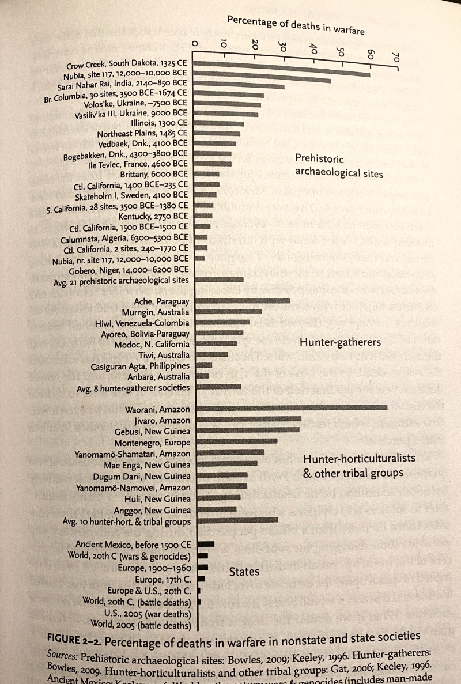

# The Better Angels of Our Nature: Why Violence Has Declined

(2011)

By Steven Pinker

## About the author

Steven Pinker is oe of America's leading public intellectuals.

From [Wikipedia](https://en.wikipedia.org/wiki/Steven_Pinker):

>  Pinker is a Canadian-American cognitive psychologist, linguist, and popular science author. He is an advocate of evolutionary psychology and the computational theory of mind.

> Pinker's academic specializations are visual cognition and psycholinguistics. His experimental subjects include mental imagery, shape recognition, visual attention, children's language development, regular and irregular phenomena in language, the neural bases of words and grammar, and the psychology of cooperation and communication, including euphemism, innuendo, emotional expression, and common knowledge. He has written two technical books that proposed a general theory of language acquisition and applied it to children's learning of verbs. In particular, his work with Alan Prince published in 1989 critiqued the connectionist model of how children acquire the past tense of English verbs, arguing instead that children use default rules such as adding "-ed" to make regular forms, sometimes in error, but are obliged to learn irregular forms one by one.

# Initial reaction

Clocking in at 696 pages, this information-dense, chart-heavy 2011 look at the decline of violence in human history is probably one of the most important works of nonfiction in the past 30 years. 

It's definitely not the first book to note the decline of violence but possibly the most comprehensive, surveying the work of dozens of academic fields, hundreds of scholarly books and articles all while writing in a vivid, conversational tone that never feels condescending or wonky.

# Biggest takewaways

The title itself might come as a shock to most people -- considering world wars, the Holocaust, genocides and other horrors one might assume that the 21st century or at least the 20th cenutry might have been the bloodiest in human history.

You'd be wrong.

By a lot.

